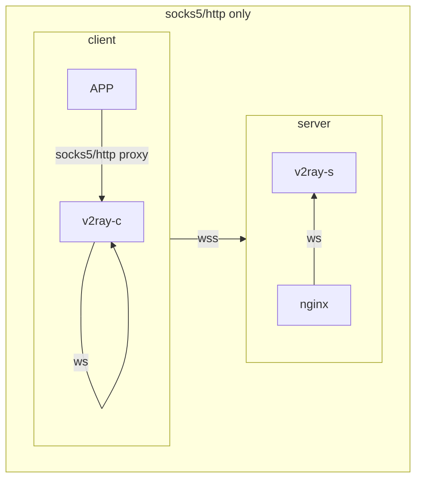
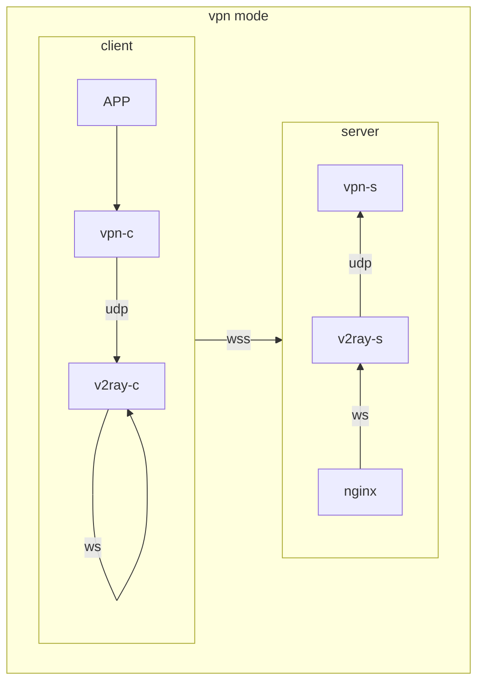

[![Contributors][contributors-shield]][contributors-url]
[![Forks][forks-shield]][forks-url]
[![Stargazers][stars-shield]][stars-url]
[![Issues][issues-shield]][issues-url]
[![MIT License][license-shield]][license-url]

  <h3 align="center">ONE-SHOT-SOLUTION-VPN-OVER-V2RAY</h3>

  

    vpn over v2ray disguised by wss, vpn is optional
  

## why vpn2fly

* **minimal steps**
  * **one shot** deploy: all handled by docker dompose
  * **one shot** connect: qrcode or shareable link generated for mobile client
  * **one parameter**: only domain is the necessary parameter
  * **auto start** after host rebooting
* **safe**
  * **certs** are **automatically** generated and updated
  * secrets are auto-generated at init stage
  * **disguise** with three layer, hard to be detected by GFW
  * **global proxy** for all you APPs by using vpn

## Prerequisites

* vps with static ip, ports 80,443 are open, ports 1024,51820 are free
* successfuly domain resolution to your vps
* `docker compose`, `dnsutils`, `qrencode`

## server side

1. `git clone https://github.com/dusmart/vpn2fly.git && cd vpn2fly`
2. `bash init.sh ${YOUR-DOMAIN}`, save the output until you finish set-up your client
3. `docker compose up -d`

see step by step [tutorial](./azure-ubuntu-debian.md) on a purely new azure vm

## mobile client

* download any v2ray client to your phone (such as [OneClick](https://apps.apple.com/us/app/oneclick-safe-easy-fast/id1545555197) for iOS)
* you can copy the output from `init.sh`, choose **import from clipboard**
* you can also scan the qrcode generated by `init.sh`

## macOS client

1. `brew install v2ray`
2. `cp client.json /opt/homebrew/etc/v2ray/config.json`, client.json is generated on server at init stage
3. `brew services start v2ray`
4. install the free [wireguard](https://apps.apple.com/us/app/wireguard/id1451685025?mt=12) in app store
5. check config showed in `vpn2fly/wireguard/peer1/peer1.conf` on server, copy it to client side, change the AllowedIPs in section \[Peer\] what showed at server init stage

---

## Roadmap

- [ ] Add more client tutorial
    - [x] free iOS client recommendation
    - [ ] android client recommendation
    - [ ] windows client
- [ ] Add one command for macOS's system proxy quick switch, see [v2rayx's switch code](https://github.com/Cenmrev/V2RayX/blob/master/v2rayx_sysconf/main.m) and [install code](https://github.com/Cenmrev/V2RayX/blob/master/V2RayX/install_helper.sh) here

## Acknowledgments

* [Docker Compose](https://github.com/docker/compose)
* [JonasAlfredsson/docker-nginx-certbot](https://github.com/JonasAlfredsson/docker-nginx-certbot)
* [v2fly/v2ray-core](https://github.com/v2fly/v2ray-core)
* [linuxserver/wireguard](https://github.com/linuxserver/docker-wireguard)

## some illustration for macos client usage

### config the socks5 and http proxy for system proxy

* find the proxy in your system proxy (search `proxy` in system settings)
* set http and https proxy to 127.0.0.1:8002
* set socks5 proxy to 127.0.0.1:1082

### use vpn over v2ray

* open/close the switch in wireguard or system settings are both OK

[contributors-shield]: https://img.shields.io/github/contributors/dusmart/vpn2fly.svg?style=for-the-badge
[contributors-url]: https://github.com/dusmart/vpn2fly/graphs/contributors
[forks-shield]: https://img.shields.io/github/forks/dusmart/vpn2fly.svg?style=for-the-badge
[forks-url]: https://github.com/dusmart/vpn2fly/network/members
[stars-shield]: https://img.shields.io/github/stars/dusmart/vpn2fly.svg?style=for-the-badge
[stars-url]: https://github.com/dusmart/vpn2fly/stargazers
[issues-shield]: https://img.shields.io/github/issues/dusmart/vpn2fly.svg?style=for-the-badge
[issues-url]: https://github.com/dusmart/vpn2fly/issues
[license-shield]: https://img.shields.io/github/license/dusmart/vpn2fly.svg?style=for-the-badge
[license-url]: https://github.com/dusmart/vpn2fly/blob/main/LICENSE.txt
[linkedin-shield]: https://img.shields.io/badge/-LinkedIn-black.svg?style=for-the-badge&logo=linkedin&colorB=555
[linkedin-url]: https://linkedin.com/in/othneildrew
[product-screenshot]: images/screenshot.png
[Next.js]: https://img.shields.io/badge/next.js-000000?style=for-the-badge&logo=nextdotjs&logoColor=white
[Next-url]: https://nextjs.org/
[React.js]: https://img.shields.io/badge/React-20232A?style=for-the-badge&logo=react&logoColor=61DAFB
[React-url]: https://reactjs.org/
[Vue.js]: https://img.shields.io/badge/Vue.js-35495E?style=for-the-badge&logo=vuedotjs&logoColor=4FC08D
[Vue-url]: https://vuejs.org/
[Angular.io]: https://img.shields.io/badge/Angular-DD0031?style=for-the-badge&logo=angular&logoColor=white
[Angular-url]: https://angular.io/
[Svelte.dev]: https://img.shields.io/badge/Svelte-4A4A55?style=for-the-badge&logo=svelte&logoColor=FF3E00
[Svelte-url]: https://svelte.dev/
[Laravel.com]: https://img.shields.io/badge/Laravel-FF2D20?style=for-the-badge&logo=laravel&logoColor=white
[Laravel-url]: https://laravel.com
[Bootstrap.com]: https://img.shields.io/badge/Bootstrap-563D7C?style=for-the-badge&logo=bootstrap&logoColor=white
[Bootstrap-url]: https://getbootstrap.com
[JQuery.com]: https://img.shields.io/badge/jQuery-0769AD?style=for-the-badge&logo=jquery&logoColor=white
[JQuery-url]: https://jquery.com 