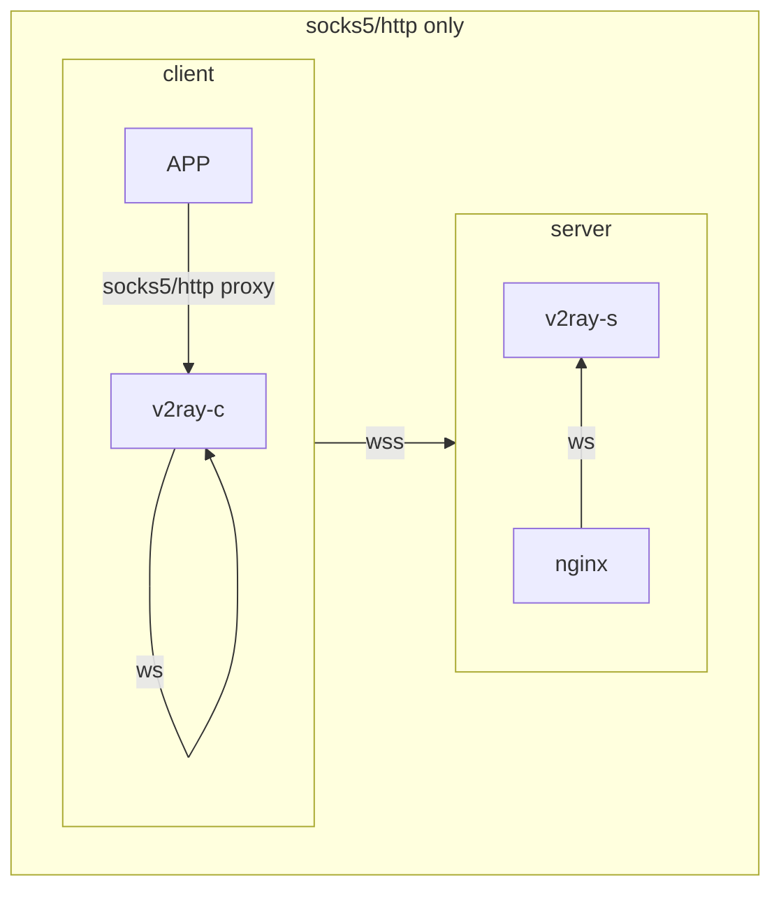
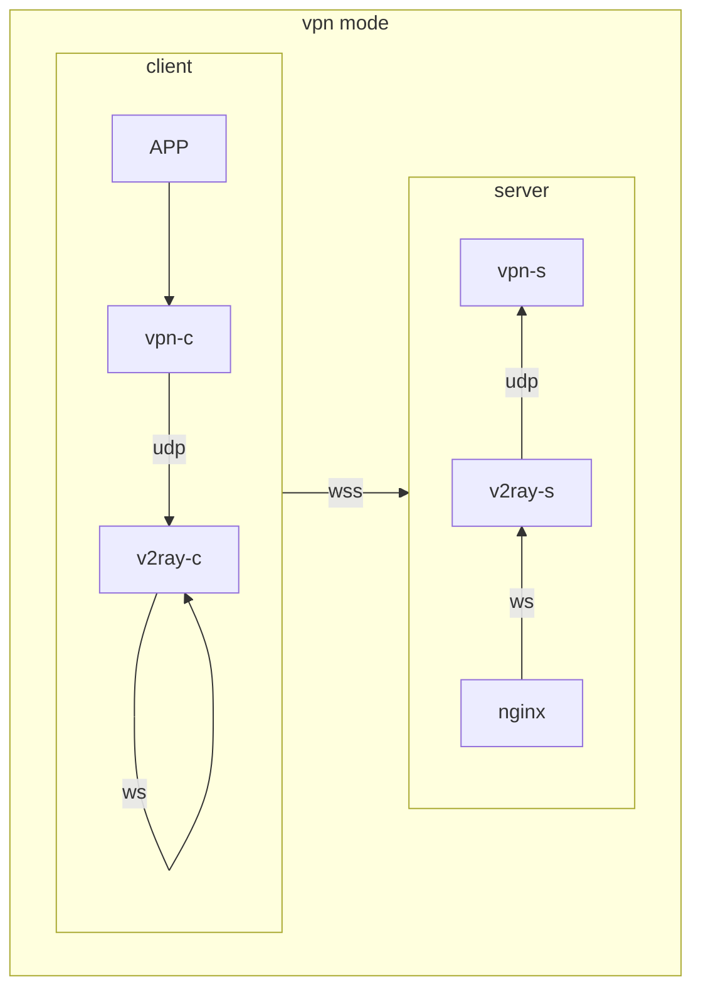

# vpn2fly

(vpn over) v2ray disguised by wss

## why vpn2fly

* **minimal steps**
  * **one shot** deploy: all handled by docker dompose
  * **one shot** connect: qrcode or shareable link generated for mobile client
  * **one parameter**: only domain is the necessary parameter
  * **auto start** after host rebooting
* **safe**
  * **certs** are **automatically** generated and updated
  * secrets are auto-generated at init stage
  * **disguise** with three layer, hard to be detected by GFW
  * **global proxy** for all you APPs by using vpn

## Prerequisites

* vps with static ip, ports 80,443 are open, ports 1024,51820 are free
* successfuly domain resolution to your vps
* `docker compose`, `dnsutils`, `qrencode`

## server side

1. `git clone https://github.com/dusmart/vpn2fly.git && cd vpn2fly`
2. `bash init.sh ${YOUR-DOMAIN}`, save the output
3. `docker compose up -d`

see step by step [tutorial](./azure-ubuntu-debian.md) on a purely new azure vm

## mobile client

* download any v2ray client to your phone (such as [OneClick](https://apps.apple.com/us/app/oneclick-safe-easy-fast/id1545555197) for iOS)
* you can copy the output from `init.sh`, choose **import from clipboard**
* you can also scan the qrcode generated by `init.sh`

## macOS client

1. `brew install v2ray`
2. `cp client.json /opt/homebrew/etc/v2ray/config.json`, client.json is generated on server at init stage
3. `brew services start v2ray`
4. install the free [wireguard](https://apps.apple.com/us/app/wireguard/id1451685025?mt=12) in app store
5. check config showed in `vpn2fly/wireguard/peer1/peer1.conf` on server, copy it to client side, change the AllowedIPs in section \[Peer\] what showed at server init stage

---

## Roadmap

- [ ] Add more client tutorial
    - [x] free iOS client recommendation
    - [ ] android client recommendation
    - [ ] windows client
- [ ] one command for macOS's system proxy quick switch, copy [v2rayx's switch code](https://github.com/Cenmrev/V2RayX/blob/master/v2rayx_sysconf/main.m) and [install code](https://github.com/Cenmrev/V2RayX/blob/master/V2RayX/install_helper.sh) here

## some illustration for macos client usage

### config the socks5 and http proxy for system proxy

* find the proxy in your system proxy (search `proxy` in system settings)
* set http and https proxy to 127.0.0.1:8002
* set socks5 proxy to 127.0.0.1:1082

### use vpn over v2ray

* open/close the switch in wireguard or system settings are both OK

