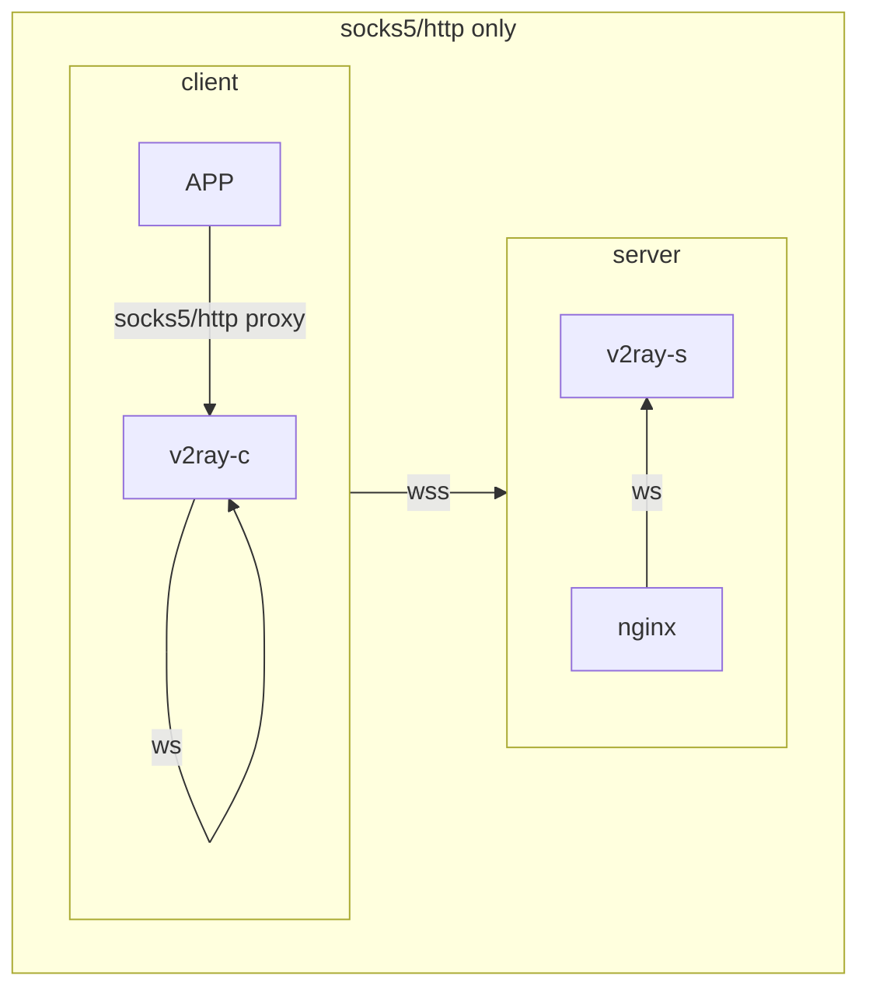
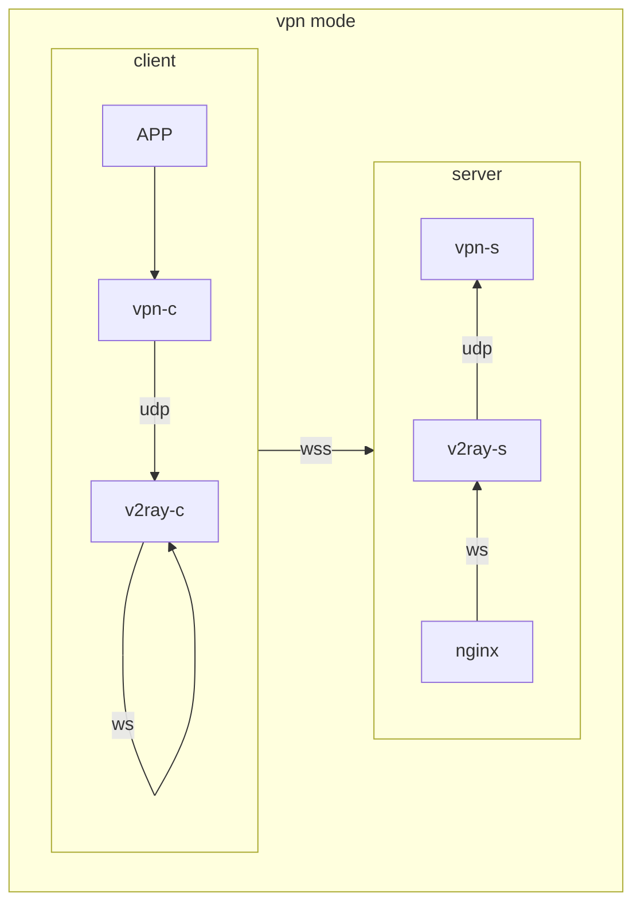

# vpn2fly

vpn over v2ray disgused by wss, vpn is optional

## why vpn2fly

* **one shot** deploy
* **one parameter**, other secrets are auto-generated at init stage
* **certs** are **automatically** generated and updated
* **disguise** with three layer, hard to be detected by GFW
* **qrcode** or **clipboard link** generated for mobile client, pair in one shot
* **global proxy** for you APPs by using vpn

## prerequest

* vps located abroad, ports 80,443,1024,51820 are free
* domain resolution to your vps succeed
* `docker compose` installed, docker network remain defaults
* [optional] `qrencode` installed for generating qrcode that can be imported by a mobile APP, ignore this if you want to import by clipboard link or add it mannually

## server side

1. `git clone https://github.com/dusmart/vpn2fly.git && cd vpn2fly`
2. `bash init.sh YOUR-DOMAIN`
3. `docker compose up -d`

## client side (phone)

> choose any option will be fine

* copy the output from `init.sh`, choose import from clipboard
* scan the qrcode generated by `init.sh`
* mannually add by choose `VMESS` -> set `Address` to `your domain` -> `Port` remains default `443` -> set `ID` to `id in clent.json` -> `Enable TLS` -> set `ServerAddress` to `your domain` -> set `Stream Setting` to `ws` -> set `Host` to `your domain` -> set `Path` to `/lazy`

## client side (mac)

### client init

ignore steps after step 3 if you only want to use v2ray

1. `brew install v2ray`
2. `cp client.json /opt/homebrew/etc/v2ray/config.json`
3. `brew services start v2ray`, will run it at computer start up
4. install the free [wireguard](https://apps.apple.com/us/app/wireguard/id1451685025?mt=12) in app store
5. check config showed in `vpn2fly/wireguard/peer1/peer1.conf` on server, add it to client side
6. modify some configs so that we can use vpn over v2ray
    1. change the ListenPort in section \[Interface\] to `51821`
    2. change the DNS in section \[Interface\] to `8.8.8.8`
    3. change the AllowedIPs in section \[Peer\] to `python3 ipcal.py YOUR-VPS-IP`, this config is also printed at server init stage, copy that will also be OK

### use the socks5 and http proxy

* find the proxy in your system proxy (search `proxy` in system settings)
* set http and https proxy to 127.0.0.1:8002
* set socks5 proxy to 127.0.0.1:1082

### use vpn over v2ray

* open/close the switch in wireguard or system settings

## TODO

* one command for macos quick switch system proxy, copy [v2rayx's switch code](https://github.com/Cenmrev/V2RayX/blob/master/v2rayx_sysconf/main.m) and [install code](https://github.com/Cenmrev/V2RayX/blob/master/V2RayX/install_helper.sh)
